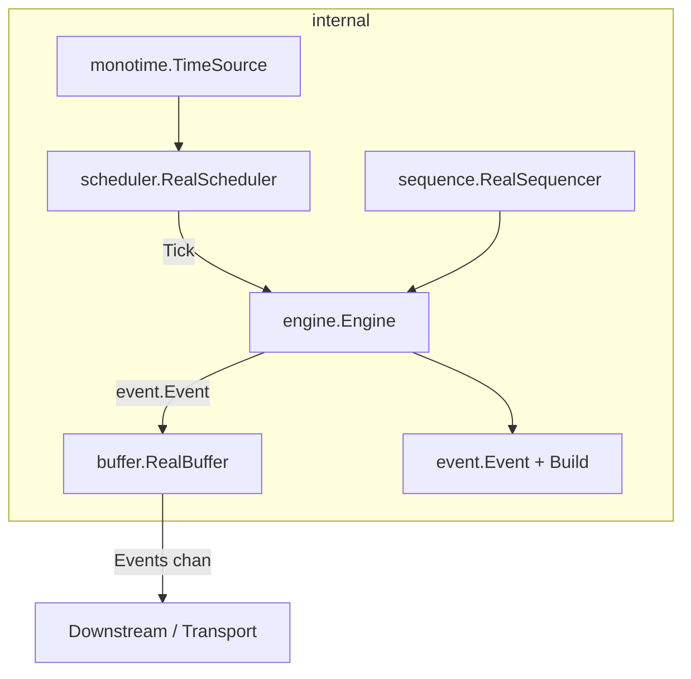

# ChronoStream — Codebase Documentation

ChronoStream is a deterministic, drift-free time-series event producer written in Go. It emits structured, immutable event packets at aligned wall-clock boundaries (second, minute, hour, day). Its design is intentionally decoupled — it knows nothing about downstream consumers, transports, or aggregation.

---

## Architecture Overview



### Core Data Flow

```
Wall Clock
    │
    ▼
monotime.TimeSource.Now()
    │
    ▼
scheduler.RealScheduler  ──── nextboundary() ──── durationFor()
    │  (emits Tick every boundary)
    ▼
engine.Engine
    ├── sequence.Sequencer.Next(freq)   → monotonic sequence number
    └── event.Build(freq, ts, seq, ...)  → immutable Event
            │
            ▼
    buffer.RealBuffer.Offer(event)
            │
            ▼
    buffer.Events() <-chan event.Event   → ready for downstream
```

---

## Package Reference

---

### `internal/event`

**Purpose**: Defines the core immutable data unit. Has zero external dependencies and no runtime side-effects.

#### `event.go` — Types

```go
type Frequency uint8

const (
    FrequencyUnknown Frequency = iota
    FrequencySecond
    FrequencyMinute
    FrequencyHour
    FrequencyDay
)
```

`Frequency` is a typed `uint8` (not a string). This guarantees:
- Compile-time exhaustive switch checking
- No invalid values can be passed at runtime
- Zero allocation type comparisons

```go
type Event struct {
    ID              string    // Deterministic identity: "{freq}-{timestamp}-{seq}"
    Timestamp       int64     // Unix nanoseconds — explicit, unambiguous
    Frequency       Frequency // Emission frequency
    Sequence        uint64    // Monotonic counter within freq window
    Seed            int64     // Deterministic: Timestamp XOR Sequence
    SchemaVersion   uint16    // Always 1 — guards downstream schema evolution
    ProducerVersion string    // Injected from outside; tracks producer binary version
    InstanceID      string    // Injected from outside; identifies which producer instance
}
```

> [!IMPORTANT]
> `Event` must never be mutated after construction. It is a value type (no pointers). Changing `ID` or `Seed` generation is a **breaking change** for all downstream consumers.

#### `builder.go` — Construction

```go
func Build(freq Frequency, ts int64, seq uint64, producerVersion string, instanceID string) Event
```

**Design rules (strictly enforced)**:
- No `time.Now()` calls
- No randomness
- No I/O
- No global state
- Pure function — same inputs always produce identical output

`buildID` → `"{freq}-{ts}-{seq}"`
`buildSeed` → `ts XOR int64(seq)` — a lightweight, reproducible signal for downstream ML/data systems.

---

### `internal/monotime`

**Purpose**: Abstract the system clock behind an interface so the scheduler can be tested without real time.

#### `monotime.go`

```go
type TimeSource interface {
    Now() time.Time
}

type RealTimeSource struct{}

func (t *RealTimeSource) Now() time.Time {
    return time.Now().UTC()
}
```

Always returns UTC. This is the only place in the codebase where `time.Now()` is called.

#### `fake_monotime.go` — Test Helper

```go
type FakeTimeSource struct { current time.Time }

func NewFakeTimeSource(t time.Time) *FakeTimeSource
func (f *FakeTimeSource) Now() time.Time      // returns current
func (f *FakeTimeSource) Advance(d time.Duration) // moves clock forward
```

Allows tests to control time with nanosecond precision — no sleeping, no real timers in tests. Lives in the `monotime` package (not `_test.go`) so other packages like `scheduler_test` can import it.

---

### `internal/scheduler`

**Purpose**: Emit a `Tick` at every aligned wall-clock boundary for a given frequency. Knows nothing about events, sequences, or buffers.

#### Tick

```go
type Tick struct {
    Frequency     event.Frequency
    ScheduledTime int64  // The boundary this tick represents (UnixNano), NOT when it fired
}
```

`ScheduledTime` is the **intended** boundary, not the actual fire time. This is critical — it decouples the event's identity from whether the goroutine woke up late.

#### Scheduler Interface

```go
type Scheduler interface {
    Start(ctx context.Context)
    Ticks() <-chan Tick
}
```

#### `RealScheduler`

```go
type RealScheduler struct {
    frequency event.Frequency
    ts        monotime.TimeSource
    ticks     chan Tick      // buffered
}
```

**`durationFor(freq)`** — maps a `Frequency` to its `time.Duration`. Centralizes this mapping so `nextboundary` has no magic numbers.

**`nextboundary(now, freq)`** — the boundary calculation engine:

| Frequency | Algorithm |
|---|---|
| Second | `Truncate(1s) + 1s` |
| Minute | `Truncate(1m) + 1m` |
| Hour | `Truncate(1h) + 1h` |
| Day | Explicit `time.Date(y,m,d,0,0,0,0,loc) + 24h` |

Day uses explicit calendar construction (not `Truncate`) because `Truncate(24h)` is relative to the UTC epoch and breaks for non-UTC timezones and DST.

**`Start(ctx)`** — the main goroutine loop:

```
loop:
  1. now = ts.Now()
  2. next = nextboundary(now, freq)   ← always recomputed, never accumulated
  3. wait = next - now                ← can be 0 if late
  4. select:
       ctx.Done → stop timer, return  (clean shutdown)
       timer.C  → emit Tick (non-blocking)
```

> [!IMPORTANT]
> **Drift prevention**: The boundary is _recomputed_ from the current time on every iteration — never by adding a fixed duration to the previous fire time. If the goroutine wakes up late (GC pause, CPU overload, system sleep), it snaps to the correct next boundary rather than accumulating error.

> [!NOTE]
> **Non-blocking emit**: The tick send uses a `select { case ch <- tick: default: }`. If the Engine is slow, ticks are dropped silently. Time does not wait for consumers.

**`Ticks()`** — returns a receive-only channel (`<-chan Tick`). Consumers cannot write to or close it.

#### Tests (`scheduler_test.go`)

All tests use `package scheduler` (white-box) to access unexported `nextboundary`.

| Test | What it verifies |
|---|---|
| `TestNextBoundarySecond` | `10:15:42.800` → `10:15:43.000` |
| `TestNextBoundaryMinute` | `10:15:42.800` → `10:16:00.000` |
| `TestNextBoundaryHour` | `10:15:42.800` → `11:00:00.000` |
| `TestNextBoundaryDay` | `2026-02-20 10:15` → `2026-02-21 00:00` |
| `TestStart` | Tick is emitted with correct `ScheduledTime` |
| `TestStart_NoConsumer` | Scheduler does not deadlock when no one reads ticks |

> [!WARNING]
> **Known TODO**: Backward time jump resolution is not yet implemented. If the system clock steps backward (NTP correction, VM migration), `nextboundary` will produce a boundary in the far future.

---

### `internal/sequence`

**Purpose**: Assign a strictly-increasing, per-frequency sequence number to each event.

```go
type Sequencer interface {
    Next(freq event.Frequency) uint64
}

type RealSequencer struct {
    counters map[event.Frequency]uint64
    mu       sync.Mutex
}
```

**Behaviour guarantees**:
- Each frequency has an **independent** counter (second ticks don't share count with minute ticks)
- Counters are **monotonically increasing** — always increment, never reset
- **Thread-safe** via `sync.Mutex` — safe for concurrent callers
- Starts at `1` (first call returns `1`, not `0`)

> [!NOTE]
> No reset is intentional. If a counter could reset, event `ID` would collide with a previous event at the same timestamp — breaking downstream deduplication.

---

### `internal/buffer`

**Purpose**: Bounded, non-blocking in-process queue between the Engine and any downstream consumer (transport, serializer, etc).

```go
type Buffer interface {
    Offer(event.Event) bool    // non-blocking: returns false if full
    Events() <-chan event.Event // read-only channel for consumers
    Len() int                  // current depth
    Cap() int                  // max capacity
}
```

`RealBuffer` is backed by a Go buffered channel. All semantics are pass-by-value — no pointers to `Event` are stored or transmitted.

**`Offer(e)`** — non-blocking select send. Returns `true` if buffered, `false` if dropped (channel full). The caller (Engine) is responsible for deciding what to do on drop.

**`Events()`** — exposes the channel as receive-only. Transport layer reads from this.

**`Len()` / `Cap()`** — introspection for metrics/monitoring.

---

### `internal/engine`

**Purpose**: Composition root. Wires all components together and manages the producer lifecycle. Does not compute, does not store, does not know about transport.

```go
type Engine struct {
    scheduler       scheduler.Scheduler
    sequencer       sequence.Sequencer
    buffer          buffer.Buffer
    producerVersion string
    instanceID      string
}
```

`Engine` intentionally does **not** implement an interface — it is the top-level coordinator and exposing an engine interface would be a wasteful abstraction.

**`Start(ctx)`**:
1. Calls `scheduler.Start(ctx)` — starts the tick goroutine
2. Spawns its own goroutine that:
   - Reads ticks from `scheduler.Ticks()`
   - Gets the next sequence number from `sequencer.Next(tick.Frequency)`
   - Builds a deterministic `event.Event` via `event.Build(...)`
   - Offers it to `buffer.Offer(ev)`
   - On `ctx.Done()`, exits cleanly

> [!NOTE]
> The Engine neither knows nor cares what frequency the scheduler uses, or what transport the buffer feeds into. All coupling is through interfaces.

> [!WARNING]
> Currently `engine.go` builds the event but does not call `buffer.Offer(ev)`. This is a **bug** — the `ev` variable is computed but unused. `buffer.Offer(ev)` needs to be added.

---

## Design Principles

| Principle | Applied Where |
|---|---|
| **No runtime side-effects in core types** | `event.Build()` — pure function |
| **Interface-driven dependencies** | Engine depends on `Scheduler`, `Sequencer`, `Buffer` interfaces |
| **No drift accumulation** | `nextboundary` recomputes from `Now()` every iteration |
| **Non-blocking everywhere** | Scheduler tick emit, Buffer offer — never block on slowness |
| **Pass-by-value** | `event.Event` has no pointer fields — safe to copy, share, send |
| **Deterministic identity** | Given same inputs, `event.Build` always produces the same Event |
| **No downstream knowledge** | Scheduler doesn't know about Buffer; Engine doesn't know about transport |
| **Testability** | `FakeTimeSource` makes scheduler fully hermetic without sleep |

---

## Known TODOs / Open Issues

| Location | Issue |
|---|---|
| `scheduler.go` | Backward time jump (NTP/VM migration) not handled |
| `engine.go` | `buffer.Offer(ev)` call is missing — event is built but not buffered |
| `sequence/sequencer.go` | `New()` constructor is missing (found in earlier version, not in current file) |
| `cmd/producer/main.go` | Still a placeholder — not wired to Engine |

---

## File Map

```
chronostream/
├── cmd/
│   └── producer/
│       └── main.go              # Entry point (placeholder)
└── internal/
    ├── event/
    │   ├── event.go             # Frequency type + Event struct
    │   └── builder.go           # event.Build() pure constructor
    ├── monotime/
    │   ├── monotime.go          # TimeSource interface + RealTimeSource
    │   └── fake_monotime.go     # FakeTimeSource for tests
    ├── scheduler/
    │   ├── scheduler.go         # Tick, Scheduler interface, RealScheduler
    │   └── scheduler_test.go    # nextboundary + Start tests
    ├── sequence/
    │   └── sequencer.go         # Sequencer interface + RealSequencer
    ├── buffer/
    │   └── buffer.go            # Buffer interface + RealBuffer
    └── engine/
        └── engine.go            # Engine composition root
```
